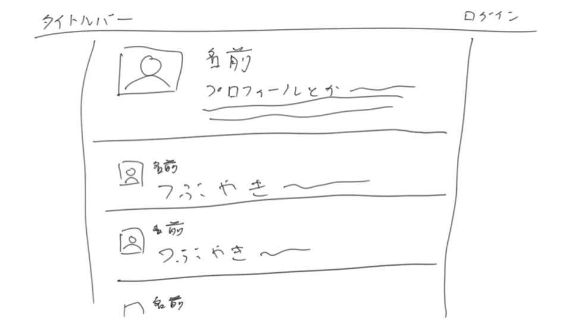

# 第二回 デザインからプロトタイピングまで

要件を決めて、プロトタイプを作って動かすまでのざっくりした流れ。

この資料は主に[スライド](slide.pdf)の補足として、あるいは後々見直すことを想定したものです。ノートの代わりにどうぞ。

## 一般的な開発の流れ
ソフトウェアを開発する上では、[**ウォーターフォールモデル**](https://ja.wikipedia.org/wiki/%E3%82%A6%E3%82%A9%E3%83%BC%E3%82%BF%E3%83%BC%E3%83%95%E3%82%A9%E3%83%BC%E3%83%AB%E3%83%BB%E3%83%A2%E3%83%87%E3%83%AB)というやつが一般的(な気がする)。

1. 要件定義
2. 概要設計
3. 詳細設計
4. 開発
5. テスト

という感じの流れを経て開発を行なう手法。

それぞれの工程がどこまで終わったかを、[棒グラフみたいなやつ（ガントチャート）](https://ja.wikipedia.org/wiki/%E3%82%AC%E3%83%B3%E3%83%88%E3%83%81%E3%83%A3%E3%83%BC%E3%83%88)で管理することが多い。

今なにをやるべきか、あとどのくらいで出来るかの管理がしやすいのがメリット。
だけど、終わったと思っていた作業にミスが見付かったりすると、途端に全てやりなおす必要が出たりするのでとてもつらい。

つらいのでやめろと言われがちだけれど、「何を作るのかを決める」、「どう作るのかを決める」、「作って試してみる」という流れはどんな手法でも共通している。
ので、ウォーターフォールモデルに則って開発をする気がなくても、この流れを意識するのは重要かもしれない。

## 講義内で紹介した方法
講義内では、[プロトタイプモデル](https://www.weblio.jp/content/%E3%83%97%E3%83%AD%E3%83%88%E3%82%BF%E3%82%A4%E3%83%97%E3%83%A2%E3%83%87%E3%83%AB)っぽいものを紹介した。（厳密にはちょっとちがうかも）

1. 欲しい機能を決める
2. デザインを決める
3. 作ってみる

というのが講義で紹介したもの。

プロトタイプモデルというと、以下のようなものになる。

1. どの機能を作るか決める
2. 試作品を作る
3. 出来栄えや作り方の善し悪しなどを評価する

どちらも、とりあえずやってみようぜという感じ（※講師の雑な理解です）。

前者と後者の最大の違いは、作る物の全体像が見えているのが後者、見えていないのが前者。
とはいえ、プロトタイプモデルでも作っているうちに仕様が変わることはよくあることなので、大した違いではない。

このやり方の目的は、ぼんやりとしたイメージを形にしつつ、ついでに成果物も作るということにある。
「やってみたら案外難しかったので卒業出来そうにない」というのも避けられるので多分とても安全。
そういう意味では、難しそうな所から着手するのがおすすめ。

### 「欲しい機能」の決め方
イメージしやすさという点で、見た目やデザインを軸に決めていくのがおすすめ。
ホームページを作るのであれば、どんなページが欲しいのか、そのページにはどんな画像やボタンがあるのか、などを決めてゆくと楽。

デザインの他に、使ったことがない技術、イメージの付かない技術は先に試しておいた方が無難。
たとえばTwitterと連動するアプリを作りたいのなら、Twitterとの連動はどのくらいの難易度なのか、何が出来て何が出来ないのかなどのイメージが付かないはず。
そういうものは、単独で試しておいた方が、企画を練る点でもデザインをする点でも楽になるはず。

なんとなく欲しい機能がいくつか出てきたら、一番重要そうなものを考える。
ゲームサイトを作りたいのであれば、スコアをSNSで共有する機能より、先にゲームをプレイ出来るようにする、などなど。

重要そうな機能が一通り揃ったら、もしくは行き詰まったら、それ以外の楽しそうな物や、手間の掛かりそうな物を優先して別のことに着手する。
楽しそうなタスクを常に抱えておくのは（飽きっぽい講師にとっては）結構重要。

### デザインをプログラムにする
デザインがなんとなく決まったら、それぞれの要素(画像とかボタンとか)に必要なデータは何かを考える。
例えば以下のようなプロフィール画面のデザイン(？)があったら、「ユーザー名」、「プロフィール画像」、「プロフィール文」、「ログイン・ログアウトボタン」、「つぶやきの情報」あたりが必要そうな気がする。

必要な情報が分かったら、それをプログラム上のクラスとか関数とかに落とし込んでいく。
あとは表示する部分を作れば、とりあえずなんとなく動くっぽいものが出来るはず。
なんとなくまで作ってから、残りを作り込んでゆくとモチベーションが持つのでおすすめ。

ここでの手順と逆に、クラスだの関数だのの設計を先にしようとすると、かなりの経験が無い限りは足りないデータとか余計なデータとかが出てきて詰んでしまうので注意。

### プロトタイプを作る上で重要なこと
ここで作っている物は、あくまでプロトタイプ、試作品であるということを忘れてはいけない。
なので、よく分からなくなってきたり、ぐちゃぐちゃしてきたなと思ったら、放棄したり、作り直したりする事を検討すると良いかもしれない。

## その他の方法
よく語られる設計開発の手法として、ウォーターフォール、プロトタイプの他に、[アジャイル](https://ja.wikipedia.org/wiki/%E3%82%A2%E3%82%B8%E3%83%A3%E3%82%A4%E3%83%AB%E3%82%BD%E3%83%95%E3%83%88%E3%82%A6%E3%82%A7%E3%82%A2%E9%96%8B%E7%99%BA)と言われるものがある。
といっても、アジャイルという言葉には「何かイケイケでヤバいナウでヤングな開発手法」みたいなニュアンスしかない(と勝手に思っている)。

ググると色々出てくるので、興味があれば見てみても良いかもしれない。多分あんまり役に立たない。

## おまけ
### 紹介したツール
講義で紹介したデザインに使うツール。

#### POP
手書きのデザインをスマホで撮って、動かせるようにするやつ。

- [公式サイト](https://marvelapp.com/pop/)
- [プレゼン中再生した動画](https://www.youtube.com/watch?v=EGp20lVwUa8)

#### moqups
サイトやアプリのデザインを作ったり動かしたり出来るようにするもの。
所謂 **ワイヤーフレームツール** というものの一種。

- [サイト](https://moqups.com/)

#### Android Studio
Androidアプリを作るためのgoogle公式IDE。
紹介したのはこのソフトのデザインツールの部分。

- [公式サイト](https://developer.android.com/studio/index.html?hl=ja)

### デモで作成したもの
#### Androidアプリ
[live-coding/android](./live-coding/android/)から見れます。
[まとめてダウンロード](https://github.com/macrat/meguro-lab-basic-technical-lecture/archive/master.zip)して[Android Studio](https://developer.android.com/studio/index.html?hl=ja)で試すことも出来ます。

#### Webサイト
[live-coding/web.html](./live-coding/web.html)にあります。
ブラウザでどう表示されるか見たい場合は[こちら](https://cdn.rawgit.com/macrat/meguro-lab-basic-technical-lecture/HEAD/02/live-coding/web.html)から見れます。もちろん、HTMLファイルをダウンロードして開くことも出来ます。
